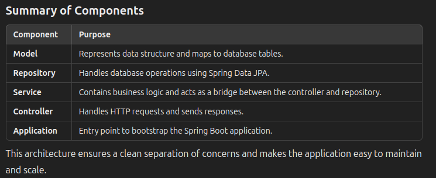

### Annotations

#### The Entity Annotation
1. This Annotation indicates that a Java class is marked as a Java Persistence API (JPA) entity. JPA provides a standard for object-relational mapping (ORM) in Java applications, and this annotation specifies that a class will be mapped to a database table.
   
2. Entities in JPA are nothing but POJOs representing data that can be persisted in the database. An entity represents a table stored in a database. Every instance of an entity represents a row in the table.

#### The Id Annotation
Each JPA entity must have a primary key that uniquely identifies it. The @Id annotation defines the primary key.
We can generate the identifiers in different ways, which are specified by the @GeneratedValue annotation.

We can choose from four id generation strategies with the strategy element. The value can be AUTO, TABLE, SEQUENCE, or IDENTITY:

#### The Table Annotation
IN most cases the name of the table in the database and the name of the entity won’t be the same.
In these cases, we can specify the table name using the @Table annotation:
```
@Entity
@Table(name="STUDENT")
public class Student {
    // fields, getters and setters
}
```

We can also mention the schema using the schema element:
```
@Entity
@Table(name="STUDENT", schema="SCHOOL")
public class Student {

    // fields, getters and setters

}
```

#### The Column Annotation
The @Column annotation has many elements such as name, length, nullable, and unique:
```
@Entity
@Table(name="STUDENT")
public class Student {
    @Id
    @GeneratedValue(strategy=GenerationType.AUTO)
    private Long id;
    
    @Column(name="STUDENT_NAME", length=50, nullable=false, unique=false)
    private String name;
    
    // other fields, getters and setters
}
```

// The name element specifies the name of the column in the table. The length element specifies its length. The nullable element specifies whether the column is nullable or not, and the unique element specifies whether the column is unique.

// If we don’t specify this annotation, the name of the column in the table will be the name of the field.

#### The Transient Annotation
we may want to make a field non-persistent. We can use the @Transient annotation to do so. It specifies that the field won’t be persisted.

For instance, we can calculate the age of a student from the date of birth.
```
@Entity
@Table(name="STUDENT")
public class Student {
    @Id
    @GeneratedValue(strategy=GenerationType.AUTO)
    private Long id;
    
    @Column(name="STUDENT_NAME", length=50, nullable=false)
    private String name;
    
    @Transient
    private Integer age;
    
    // other fields, getters and setters
}
```

#### The Temporal Annotation
```
@Entity
@Table(name="STUDENT")
public class Student {
    @Id
    @GeneratedValue(strategy=GenerationType.AUTO)
    private Long id;
    
    @Column(name="STUDENT_NAME", length=50, nullable=false, unique=false)
    private String name;
    
    @Transient
    private Integer age;
    
    @Temporal(TemporalType.DATE)
    private Date birthDate;
    
    // other fields, getters and setters
}
```

#### The Enumerated Annotation
we may want to persist a Java enum type.

We can use the @Enumerated annotation to specify whether the enum should be persisted by name or by ordinal (default):

```
public enum Gender {
    MALE, 
    FEMALE
}

@Entity
@Table(name="STUDENT")
public class Student {
    @Id
    @GeneratedValue(strategy=GenerationType.AUTO)
    private Long id;

    @Column(name="STUDENT_NAME", length=50, nullable=false, unique=false)
    private String name;
    
    @Transient
    private Integer age;
    
    @Temporal(TemporalType.DATE)
    private Date birthDate;
    
    @Enumerated(EnumType.STRING)
    private Gender gender;

    // other fields, getters and setters
}
```